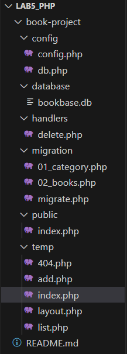
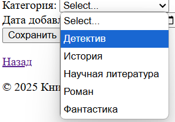
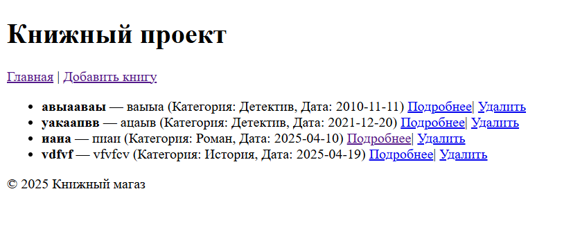
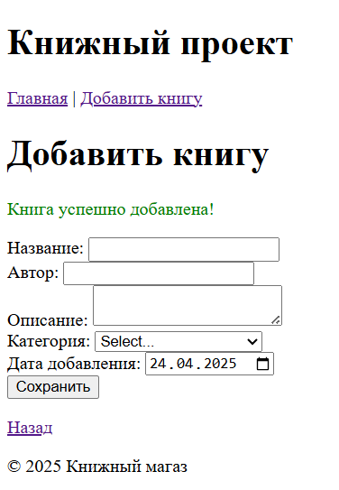
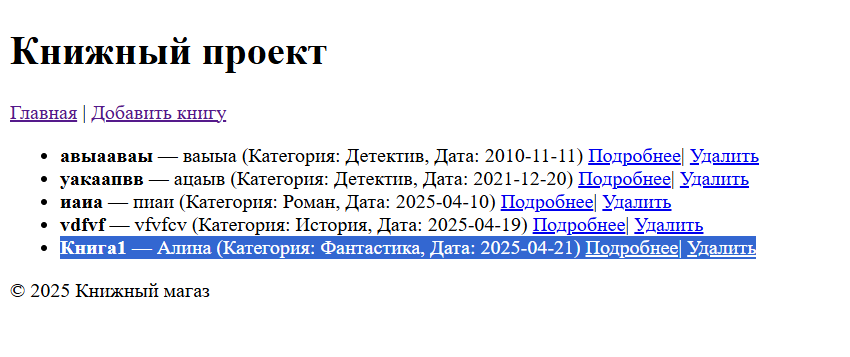
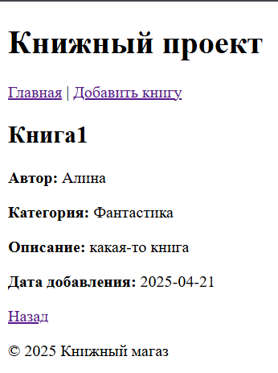

# Отчет по лабе №5. Контрольные вопросы. SQL-инъекции в вашем приложении.

## Описание лабораторной работы
Цель лабораторной работы — разработать веб-приложение для управления книгами. Приложение позволяет:
- Добавлять книги с указанием автора, категории, описания и даты добавления.
- Просматривать список книг с категориями.
- Удалять книги.
- Просматривать подробную информацию о книге.


## Структура проекта
- `config/` Содержит конфигурационные файлы для подключения к базе данных.
- `database/` Хранит файл базы данных SQLite.
- `handlers/` Содержит обработчики действий, таких как удаление книги.
- `migration/` Содержит файлы миграций для создания таблиц базы данных.
- `public/` Содержит точку входа в приложение (index.php).
- `temp/` Содержит шаблоны страниц, такие как список книг, форма добавления книги и страница ошибки.





## Примеры использования проекта
### Добавление книги
1. Перейдите на страницу "Добавить книгу".
2. Заполните форму:
Название: "Пример книги"
Автор: "Иван Иванов"
Категория: "Выбрать из того что есть"



Описание: "Описание книги"
Дата добавления: "2023-10-01"
3. Нажмите "Сохранить". Книга будет добавлена в базу данных.






Добавили книгу




Также можно посмотреть подробную информацию



## Контрольные вопросы

**1. Какие преимущества даёт использование единой точки входа в веб-приложении?**

Единая точка входа — это когда все запросы пользователя обрабатывает один файл. Это удобно, потому что:
- Легче контролировать работу приложения из одного места
- Удобно добавлять проверки безопасности (например, проверку авторизации)
- Упрощает обработку ошибок и маршрутизацию
- При изменениях не нужно искать по всем файлам, достаточно исправить один

---

**2. Какие преимущества даёт использование шаблонов?**
- Код становится понятнее и легче для поддержки
- Можно быстро менять дизайн сайта, не трогая его логику
- Один шаблон можно использовать несколько раз с разными данными

---

**3. Какие преимущества даёт хранение данных в базе по сравнению с хранением в файлах?**
База данных даёт такие преимущества:
- Легче искать, изменять и удалять нужные данные
- База защищает от одновременного конфликта при работе нескольких пользователей
- Можно использовать сложные фильтры и запросы
- База работает быстрее с большими объёмами информации и хранит данные организованно

---

**4. Что такое SQL-инъекция? Придумайте пример SQL-инъекции и объясните, как её предотвратить.**
SQL-инъекция — это атака, когда злоумышленник подставляет вредный код вместо обычных данных, чтобы обмануть базу данных и получить доступ или повредить информацию.

**Пример:**

```sql
SELECT * FROM users WHERE login = '$login' AND password = '$password';
```

Если ввести в поле `login`:

```
' OR '1'='1
```

Запрос станет:

```sql
SELECT * FROM users WHERE login = '' OR '1'='1' AND password = '';
```

Такой запрос всегда "сработает" и даст злоумышленнику доступ.

**Как защититься:**
- Использовать подготовленные запросы (prepared statements).
- Проверять и фильтровать пользовательский ввод.
- Не вставлять данные пользователя напрямую в SQL-запросы.

---


## SQL-инъекции в вашем приложении и объясните, как вы её предотвратили.

1. Уязвимость при удалении книги (delete.php)
Если идентификатор книги передаётся через GET-запрос и используется напрямую, это может быть уязвимостью. Например:

```php
$id = $_GET['id'];
$query = "DELETE FROM books WHERE id = $id";
$pdo->exec($query);
```

Если злоумышленник передаст в URL строку delete.php?id=1 OR 1=1, запрос станет:

```
DELETE FROM books WHERE id = 1 OR 1=1;
```
Этот запрос удалит все записи из таблицы books.

- Как предотвращено в проекте:
Используется подготовленный запрос с параметром:

```php
if (isset($_GET['id']) && is_numeric($_GET['id'])) {
    $id = (int)$_GET['id'];
        $stmt = $pdo->prepare("DELETE FROM books WHERE id = ?");
    $stmt->bindParam(':id', $id , PDO::PARAM_INT);
```

2. Уязвимость при добавлении книги (add.php)

```php
// Уязвимый код
$query = "SELECT COUNT(*) FROM books WHERE title = '$title' AND author = '$author'";
$result = $pdo->query($query);
```

```
SELECT COUNT(*) FROM books WHERE title = '' OR 1=1 --' AND author = '';
```


- Как предотвращено в проекте:
Вместо прямой вставки данных используются подготовленные запросы, которые предотвращают выполнение вредоносного SQL-кода:

```php
$stmt = $pdo->prepare("
    SELECT COUNT(*) 
    FROM books 
    WHERE title = ? 
      AND author = ? 
      AND category_id = ? 
      AND description = ? 
      AND created_at = ?
");
$stmt->execute([$title, $author, $category_id, $description, $created_at]);
```


3. Отображение списка книг (index.php):

```php
// Уязвимый код
echo "<li>
    <strong>" . $row['title'] . "</strong> — " . $row['author'] . 
    " (Категория: " . $row['category_name'] . ", Дата: " . $row['created_at'] . ")
    <a href='index.php?route=list&id=" . $row['id'] . "'>Подробнее</a> |
    <a href='index.php?route=delete&id=" . $row['id'] . "'>Удалить</a>
</li>";
```

Для защиты от XSS-атак используется функция htmlspecialchars, которая экранирует специальные символы:

```php
// Безопасный код
echo "<li>
    <strong>" . htmlspecialchars($row['title']) . "</strong> — " . htmlspecialchars($row['author']) . 
    " (Категория: " . htmlspecialchars($row['category_name']) . ", Дата: " . htmlspecialchars($row['created_at']) . ")
    <a href='index.php?route=list&id=" . $row['id'] . "'>Подробнее</a> |
    <a href='index.php?route=delete&id=" . $row['id'] . "'>Удалить</a>
</li>";
```

Функция htmlspecialchars преобразует специальные символы, такие как <, >, &, и " в их HTML-сущности (&lt;, &gt;, &amp;, &quot;), предотвращая выполнение вредоносного кода.
